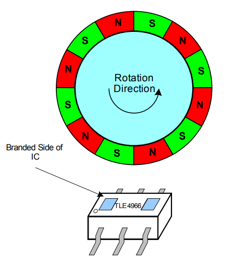
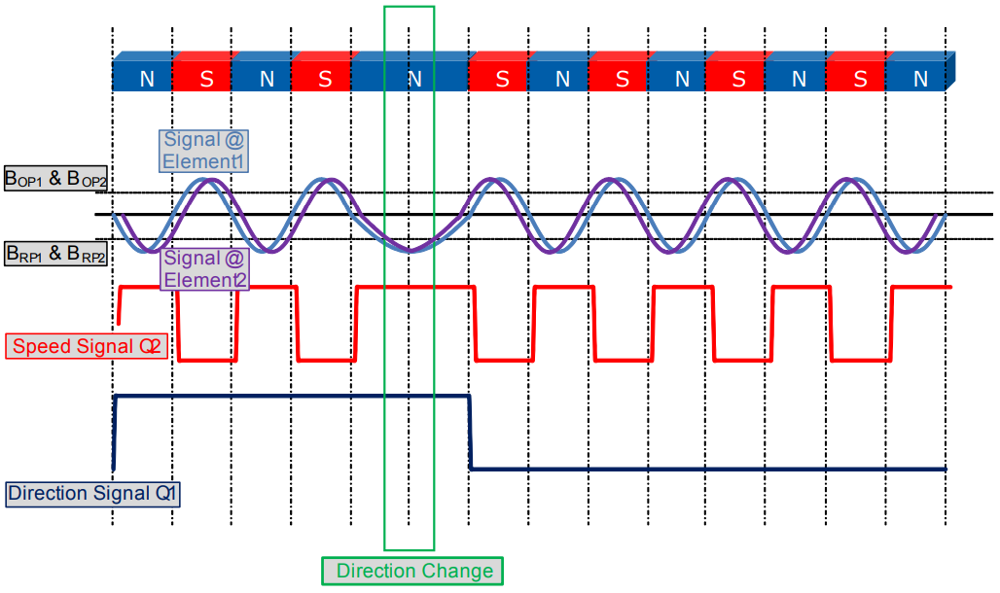
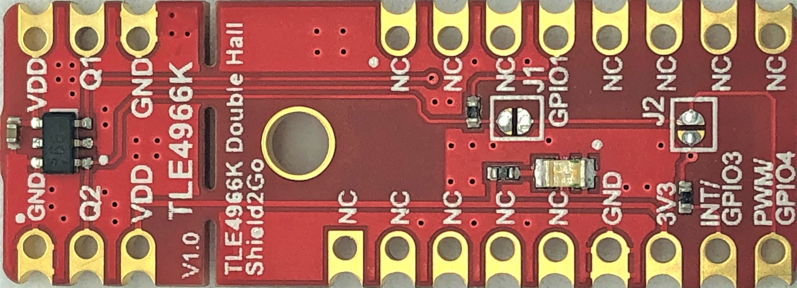
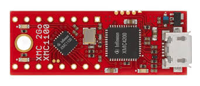
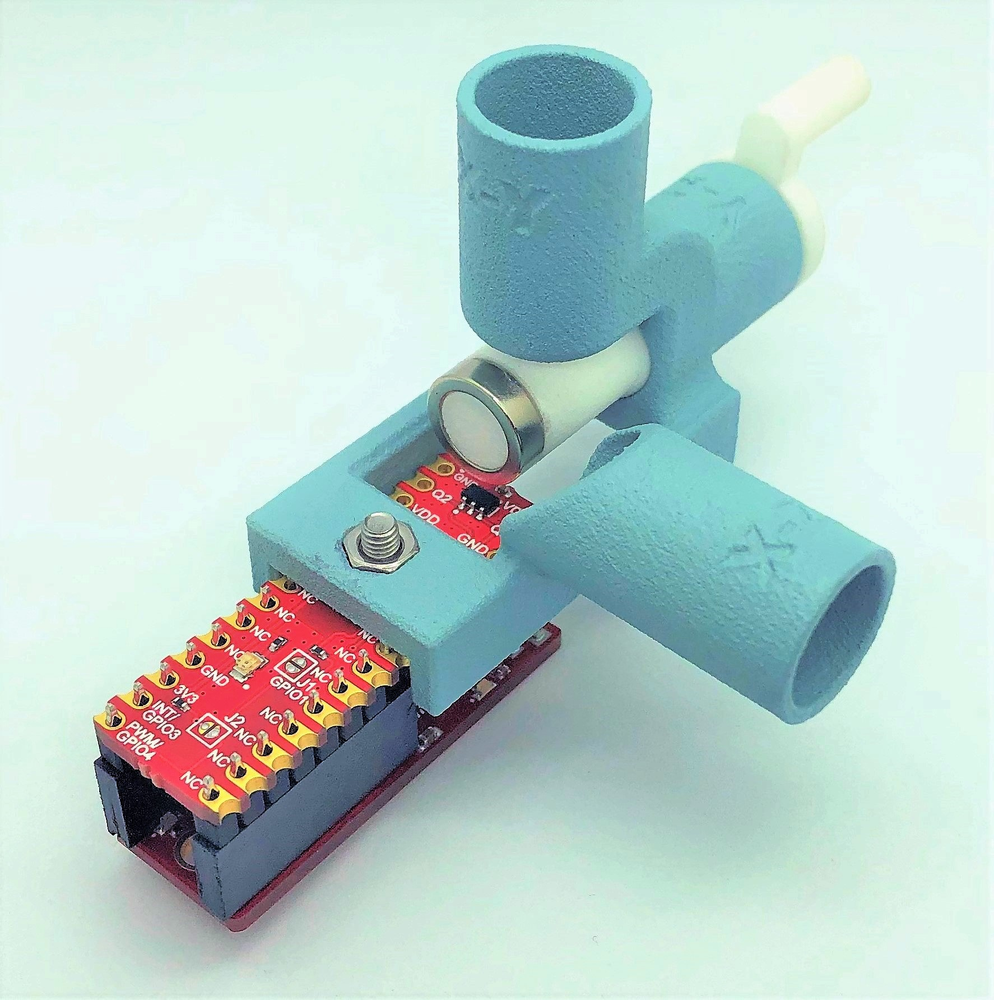
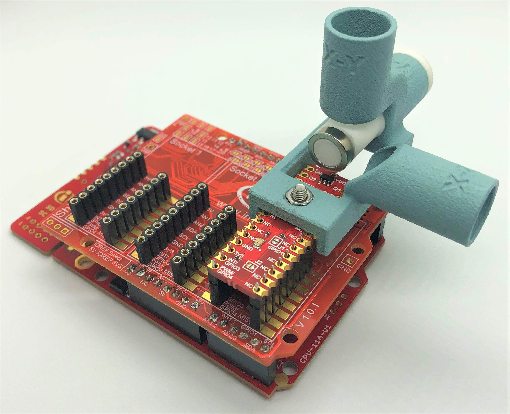
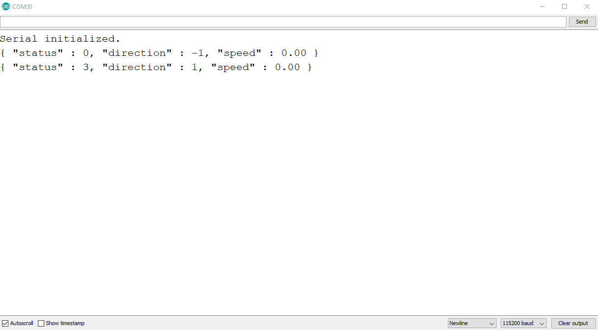
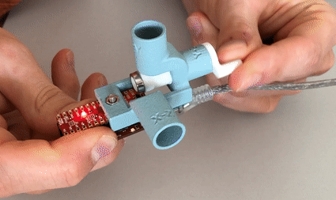

# TLx4966-Direction-Speed-Sensor

[](https://github.com/Infineon/TLx4966-Direction-Speed-Sensor/actions/workflows/compile_examples.yml)

C/C++ library of Infineon's double Hall-effect **direction and speed sensor** family for magnetic sensing applications.

 1. [Overview](#ovw)
 2. [Supported Hardware](#s-hw)
 3. [Software Requirements](#sw-req)
 4. [Library Usage](#lib-usage)
 5. [Demo Application Example](#demo-ex)
 6. [References](#refs)

<a name="ovw"></a>

## 1. Overview

### TLx4966 Family Functional Description

The TLx4966 are a family of integrated circuit double Hall-effect sensors designed specifically for highly accurate applications. Precise magnetic switching points and high temperature stability are achieved by active compensation circuits and chopper techniques on chip. They provide a speed signal at Q2 for every magnetic pole pair and a direction information at Q1, which is provided before the speed signal. 

 

### TLx4966 Family Features 

* 2.7 V to 24 V, and 3.5 to 32 V (for TLx4966**V**) supply voltage operation
* Operation from unregulated power supply
* High sensitivity and high stability of the magnetic switching points
* High resistance to mechanical stress by Active Error Compensation
* Reverse battery protection (-18 V)
* Superior temperature stability
* Peak temperatures up to 125°C (for TL**I**4966) and 195° (for TL**E**4966) without damage
* Low jitter (typ. 1 μs)
* Digital output signals
* Excellent matching between the 2 Hall probes
* Hall plate distance 1.45 mm (except TLx4966**V-1K** with 1.25 mm)
* Direction & speed information
* Direction signal switches before the speed signal
* SMD package PG-TSOP6-6-5 (for TLx4966 **(K)**), and PG-TSOP6-6-9 (for TLx4996 **(G)**)  
* THD package PG-SSO-4-1 (for TLx4966 **(L)**)

Special Features of the Vertical Variant (TLx4966**V**-(G)/(K)):
* In-Plane sensing 
* Output over current and over temperature protection
* Over voltage capability up to 42 V without external resistor
* Lower jitter (typ. 0.3 μs)

### TLx4966 Family Applications

* Window lifter
* Sunroof
* Automatic tailgate
* Automated doors
* Sun blinds
* Any applications with the need of speed and direction detection

<a name="s-hw"></a>

## 2. Supported Hardware

### TLx4966 Shields2Go
The library has been customized for the **TLE4966K** and **TLI4966G** (coming soon) Shields2Go and the Arduino environment. 



The complete documentation as schematic and pinout diagram of the boards is included in the **Quick Start Guide**:
* [TLE4966K S2Go](https://www.infineon.com/dgdl/Infineon-Getting%20Started%20TLE4966K-GettingStarted-v01_00-EN.pdf?fileId=5546d4626c1f3dc3016c65fa716c1fd0) 
* [TLI4966G S2Go](websitelink) (coming soon)

### Verified Hardware Platforms

The library examples have been built and successfully executed on the following hardware platforms:

MCU Platforms |
---           |
[XMC 2Go](https://www.infineon.com/cms/en/product/evaluation-boards/kit_xmc_2go_xmc1100_v1/) | 
[XMC1100 Boot Kit](https://www.infineon.com/cms/en/product/evaluation-boards/kit_xmc11_boot_001/#ispnTab1) |
[XMC4700 Relax Kit for 5V Shields](https://www.infineon.com/cms/en/product/evaluation-boards/kit_xmc47_relax_5v_ad_v1/) |
[Arduino Uno Rev3](https://store.arduino.cc/arduino-uno-rev3) |   

The Shield2Go form factor is designed to be stacked directly into the XCM 2Go microcontroller board. The [MyIoT Adapter Shield](https://www.infineon.com/cms/en/product/evaluation-boards/my-iot-adapter/) can be used to attach the Shield2Go with any Arduino UNO hardware compatible boards. 



The firmware pin allocation is configured for the usage of **Socket 2/3** of the MyIoT Adapter Shield. The **Socket 1 configuration is not available**.


Check the [Quick Start Guide](https://www.infineon.com/dgdl/Infineon-quick_starter_guide-Shield2Go_MY_IoT_Adapter-GS-v01_00-EN.pdf?fileId=5546d462677d0f460167bbdbd8521af9) for the complete information and pinout diagram of the MyIoT adapter.

#### Additional hardware platforms 

The library is meant to be directly compatible with any other Arduino UNO platforms. Any new validated hardware platform will be added to the MCU Platforms list above.

For any other custom configuration, please check the specific PCB documentation. The information about the IC components can be found in their respective datasheets [TLE4996K](https://www.infineon.com/dgdl/Infineon-TLE4966K-DS-v01_00-en.pdf?fileId=db3a30431f848401011fbc945ed46383) and [TLI4966G](https://www.infineon.com/dgdl/Infineon-TLI4966G-DS-v01_00-EN.pdf?fileId=5546d46269e1c019016a2acfa3af258c), and the overall Infineon´s [Hall switches documentation](https://www.infineon.com/cms/en/product/sensor/magnetic-sensors/magnetic-position-sensors/hall-switches/) on the Infineon website. 

#### Additional compatible sensors

Although there is no official Shield2Go or evaluation PCB, this firmware library can be configured to operate the following sensors of the TLx4966 family:

* TLE4966V-1K
* TLE4966L
* TLE4966-3K

Find out more about their particular features on the links to each product page in the [References](#refs) section. 

<a name="sw-req"></a>

## 3. Software Requirements

### Supported Toolchain Software 

The library examples has been built successfully with the following toolchain software:

Framework | IDE         | Versions                    | MCU Platform Core Libs        | Versions  
---       | ---         |---                          | ---                           |--- 
Arduino   | Arduino IDE | 1.8.9                       | [XMC for Arduino](https://github.com/Infineon/XMC-for-Arduino)     | 1.2.1     
Arduino   | PlatformIO  | Home 2.0.2·Core + 4.0.0a8   | [Infineon XMC](https://github.com/Infineon/platformio-infineonxmc) | 1.1.2 

### Software Dependencies

There are no additional library dependencies required by the TLx4966 library or its examples other than the **MCU Platform Core Libs** (check how to install them in the Library Usage [section](#lib-usage)).

<a name="lib-usage"></a>

## 4. Library Usage

### Source Code Documentation

Find the source code documentation in **Doxygen** format on the following [link](https://infineon.github.io/TLx4966-Direction-Speed-Sensor/).

### Arduino IDE

If you are new to Arduino IDE, please [download](https://www.arduino.cc/en/Main/Software) and install it first.

The official Arduino Boards are already available in the IDE, but other third party boards as the Infineon XMC MCU based need to be explicitly included. Follow the instructions in the [link](https://github.com/Infineon/XMC-for-Arduino#installation-instructions) to add the XMC board family to Arduino. Once installed, you can select the one of the supported board from the menu *Tools > Board:...* and configure its parameters.

Then we simply need to install the library to use it in your project:

1. **Install the library**. Download this library as a .zip file (get the latest release version [here](https://github.com/Infineon/TLx4966-Direction-Speed-Sensor/releases). Install the library in the Arduino IDE in the menu *Sketch > Include Library > Add .ZIP library*.

2. **Include it in your sketch**. With the library installed in the Arduino IDE, you can include it from the menu "Sketch > Include Library > TLx4966-Direction-Speed-Sensor". The header ``` #include <TLx4966-ino.h> ``` will be added to your sketch. You can also open and test one of the examples provided in  *File > Examples > TLx4966-Direction-Speed-Sensor* (find an example in the [Demo Application Example](#demo-ex) section).

### PlatformIO 

If you are new to PlatformIO, download and install first Visual Studio Code and the PlatformIO plugin. Please follow the instructions on the [official website](https://docs.platformio.org/en/latest/ide/pioide.html). Then go through [this tutorial](https://diyprojects.io/install-ide-platformio-extension-visual-studio-code-vscode-windows-32-bit-linux/#.XOVQP44zYnI) to get started with PlatformIO in VSCode and create a new project. 

With the project created, now the library and its dependencies can be configured in the ***Platform.ini* Project File**. This file, located in the project root folder, includes one (or several) building environments *[env:__]*. In the *environment* section, the platform, board, and framework are specified. PlatformIO will take care of downloading and installing all dependencies.
In the following example, we use the XMC 2Go Evaluation Kit (only available for Arduino):

```
[env:xmc1100_xmc2go]
platform = infineonxmc
board = xmc1100_xmc2go
framework = arduino

lib_deps =
# Using a library name
TLx4966-Direction-Speed-Sensor
    
# Using the repository URL
    https://github.com/Infineon/TLx4966-Direction-Speed-Sensor.git#master
```

### Pin Configuration

The pin configuration can be found in *hw-platf/TLx4966-platf-ard.c*. The corresponding direction and speed signal pins are allocated for the hardware stacks "Shield2Go + XMC 2Go" and "Shield2Go + MyIoT Adapter + Arduino UNO Form Factor boards" :

```
#ifdef XMC1100_XMC2GO                                                   /**< xmc2go + Shield2Go  */    
STATIC const int     speedGPIO = 4;                                     /**< Pin connected to Q2 */
STATIC const int     dirGPIO   = 9;                                     /**< Pin connected to Q1 */
#elif ((XMC1100_Boot_Kit)  || (XMC4700_Relax_Kit) || (ARDUINO_AVR_UNO)) /**< xmc arduino and arduino uno boards */  
STATIC const int    speedGPIO = 7;                                      /**< Pin connected to Q2 */
STATIC const int    dirGPIO   = 3;                                      /**< Pin connected to Q1 */
#else
# error "Board not yet defined. Please define the specific Arduino boards Pins"
#endif
```

Other pin configurations can be added here for different Arduino boards and its variants. In order to automatically select the MCU board (or family), the *board* and *board_variant" defines (``` XMC1100_XMC2GO ``` or ``` ARDUINO_AVR_UNO ```) in the *board.txt* file specification have been used. 

### Other hardware platforms and frameworks

The hardware interfaces for the Arduino hardware platforms have been implemented using the [Arduino refrence](https://www.arduino.cc/reference/en/) libraries. 

Additional hardware interface implementations can be added here for other platforms, MCU core libraries, toolchains and frameworks based on C/C++. 
Currently, no toolchain or framework integration other than Arduino is provided.

<a name="demo-ex"></a>

## 5. Demo Application Example

Magnetic sensing applications are constrained to the mechanical arrangement between the sensor and the source generating the magnetic fields variations. 

In order to evaluate the examples, additionally to the stackable hardware and the firmware, we will make use of the [Out of Shaft for 3D 2Go](https://www.infineon.com/cms/en/product/evaluation-boards/out-of-shaft-for-3d-2-go/) add-on. This accessory provide a pair of rotating poles positioned in the range of the sensor operating range.

Use the centre mounting hole of the Shield2Go to attach the Out of Shaft add-on, and then stack the board on the XMC 2Go. Alternatively, also the MyIot Shield (sockets 2 or 3) with the supported Arduino UNO form factor MCU platforms can be used as well. 

 

The positioning of the rotation planes need to be in the **X-Z** plane (as shown in the pictures).

Once the hardware is assembled, we just need to connect the board through USB to our computer. 

Go now to the Arduino IDE and install the library (following the instructions in [Library Usage - Arduino IDE](#lib-usage) section). Open one of the examples in *File > Examples > TLx4966-Direction-Speed-Sensor > switchPoll*. 

After selecting the board (Tools > Board > XMC1100 2Go*), and the proper COM port ( *Tools > Port*), the example sketch can be verified  and uploaded to the target . 

Finally, we can check the monitor output . Do not forget to select the proper baudrate. Just rotate the magnet to get some results! 

 

<a name="refs"></a>  

## 6. References

### Related Products
* [TLE4966K](https://www.infineon.com/cms/en/product/sensor/magnetic-sensors/magnetic-position-sensors/hall-switches/tle4966k/)
* [TLI4966G](https://www.infineon.com/cms/en/product/sensor/magnetic-sensors/magnetic-position-sensors/hall-switches/tli4966g/)
* [TLE4966V-1K](https://www.infineon.com/cms/en/product/sensor/magnetic-sensors/magnetic-position-sensors/hall-switches/tle4966v-1k/)
* [TLE4966L](https://www.infineon.com/cms/en/product/sensor/magnetic-sensors/magnetic-position-sensors/hall-switches/tle4966l/)
* [TLE4966-3K](https://www.infineon.com/cms/en/product/sensor/magnetic-sensors/magnetic-position-sensors/hall-switches/tle4966-3k/)
* [TLE4966K Shield2Go](https://www.infineon.com/cms/en/product/evaluation-boards/s2go_2_hall_tle4966k/) 
* [TLI4966G Shield2Go](websitelink) 
* [XMC 2Go](https://www.infineon.com/cms/en/product/evaluation-boards/kit_xmc_2go_xmc1100_v1/) 
* [XMC1100 Boot Kit](https://www.infineon.com/cms/en/product/evaluation-boards/kit_xmc11_boot_001/#ispnTab1) 
* [XMC4700 Relax Kit for 5V Shields](https://www.infineon.com/cms/en/product/evaluation-boards/kit_xmc47_relax_5v_ad_v1/) 
* [Arduino Uno Rev3](https://store.arduino.cc/arduino-uno-rev3) 
* [Out of Shaft for 3D 2Go](https://www.infineon.com/cms/en/product/evaluation-boards/out-of-shaft-for-3d-2-go/)

### Related Repositories
 - [Infineon Github](https://github.com/Infineon)
 - [XMC for Arduino](https://github.com/Infineon/XMC-for-Arduino)
 - [Infineon XMC Platformio](https://github.com/Infineon/platformio-infineonxmc)

### Useful Links
 - [Infineon for Makers](https://www.infineon.com/cms/en/tools/landing/infineon-for-makers/)
 - [Arduino](https://www.arduino.cc/)
 - [PlatformIO](https://platformio.org/)
